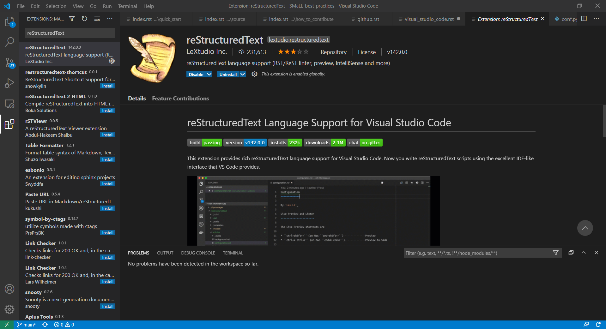

.. _visual_studio_code:

Suggested editor
================

To work with reStructuredText (``.rst``), you can use all text editors; however,  from our experience, we suggest the Visual Studio Code
which contain a specific extension to be used with this kind of file.

Get Visual Studio Code
----------------------

#. Download :download:`Visual Studio Code <https://code.visualstudio.com/Download>` 
#. Install it

   * **Linux** install the file ``code_x.xx.x-xxxxxxxx_amd64.deb``
   
   .. code-block:: bash

      sudo dpkg -i code_x.xx.x-xxxxxxxx_amd64.deb
   
   * **Windows** execute the ``VSCodeUserSetup-x64-x.xx.x.exe`` and follow the istructions.
   * **MacOS** get Virtual studio code from packages menager ``brew``:
   
   .. code-block:: bash

      $ brew cask install visual-studio-code 

.. _vsc_fig1:
.. figure:: ../img/virtual_studio_code.png
         :width: 70 %
         :alt: Virtual Studio Code GUI
         :align: center

         Virtual Studio Code GUI.
   

Add ``reStructuredText`` extension
----------------------------------

#. Go to the Visual Studio Code extension browser page by clicking the extension icon (:numref:`vsc_fig2`) or use the shortcut ``Ctrl+Shift+X``

.. _vsc_fig2:
.. figure:: ../img/extensions-view-icon.png
         :width: 12 %
         :alt: Extensions view icon.
         :align: center

         Extensions view icon.

#. In the search bar type *reStructuredText* 
#. Install the ``reStructuredText`` extension from LeXtudio Inc. (:numref:`vsc_fig3`)

.. _vsc_fig3:

         ``reStructuredText`` extension.

.. toctree::
   :maxdepth: 2
   :hidden:
