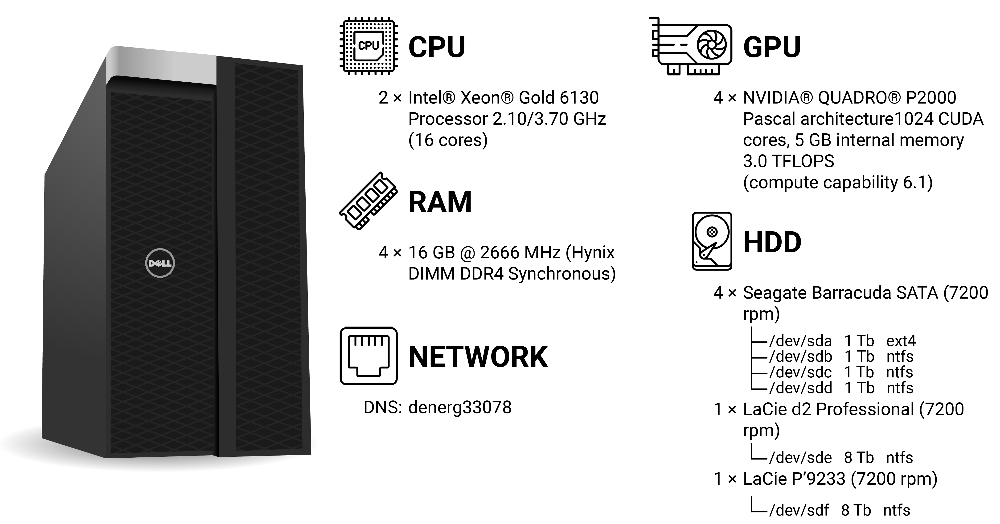

WS denerg33078 (a.k.a Prometheus)
=================================

Overview
--------

Benchmark
---------

We compute the scalability efficiency with the Eq. :eq:`eq_efficiency_prometheus`

.. math::
   \eta = \dfrac{p_N}{p_1 \cdot N} \cdot  100
   :label: eq_efficiency_prometheus

where :math:`N` is the number of cores, :math:`p_N` is the performance measure for the test with :math:`N` cores (e.g ns/day for MD simulations)
and  :math:`p_1` is the performance measured with only one core.

Tensorflow 2
^^^^^^^^^^^^

.. _prometheus_fig1:
.. figure:: ../img/TF_denerg33078.png
         :width: 70 %
         :alt: Tensorflow 2 Benchmark
         :align: center

         ``Tensorflow 2`` Benchmark results for WS Prometheus.

.. toctree::
   :maxdepth: 2
   :hidden:
