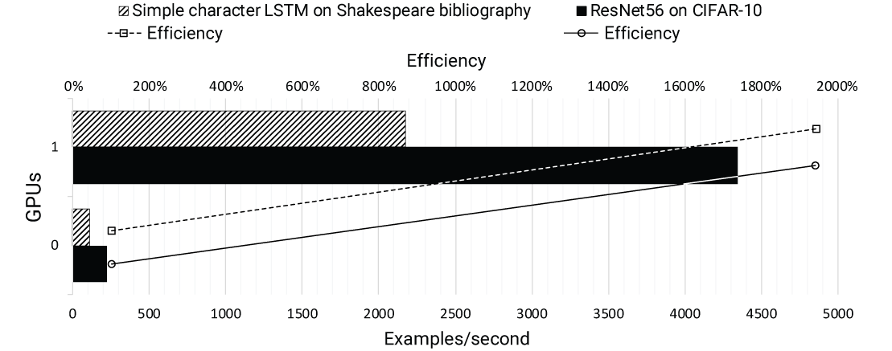

WS denerg33184 (a.k.a Titan)
============================

Overview
--------

.. image:: ../img/denerg33184.png
         :width: 100 %
         :alt: Prometheus WS
         :align: center

Benchmark
---------

We compute the scalability efficiency with the Eq. :eq:`eq_efficiency_titan`

.. math::
   \eta = \dfrac{p_N}{p_1 \cdot N} \cdot  100
   :label: eq_efficiency_titan

where :math:`N` is the number of cores, :math:`p_N` is the performance measure for the test with :math:`N` cores (e.g ns/day for MD simulations)
and  :math:`p_1` is the performance measured with only one core.

Tensorflow 2
^^^^^^^^^^^^

.. _titan_fig1:

         ``Tensorflow 2`` Benchmark results for WS Titan.

.. toctree::
   :maxdepth: 2
   :hidden:

  